# Proyecto BackEnd NEXU

Creación de proyecto BackEnd, aplicación enfocada principalmente en crear las rutas necesarias para usarse en un FrontEnd ya existente y con ello lograr que la aplicación muestre marcas y modelos.

## ¿Qué es Django?

[Documentation](https://docs.djangoproject.com/en/2.2/)

Django es un framework de alto nivel desarrollado en Python que fomenta un desarrollo y un diseño limpio y pragmatico, gratis y de código abierto.


## ¿Por qué elegí Django?

Es el primer framework que conocí cuando recién salí de la carrera y que me ha tocado trabajarlo en uno que otro proyecto, adicional a eso es un framework que puede ayudar a crear las aplicaciones de web de una forma mucho más rápida sin sacrificar mucho, aparte de que la comunidad de esta tecnología es muy grande y puedes obtener ayuda en dudas de diferentes maneras.

## ¿Por qué crear un entorno virtual en Django?

Antes de comenzar a poner manos a la obra, es importante mencionar que en este proyecto yo voy a crear un entorno virtual, antes de realizarlo compartire algunas razones por las que esto es recomendable, las cuales son las siguientes:

1.- Aislamiento de dependencias: Crear un entorno virtual nos permite mantener las dependencias necesarias o especificas del proyecto, esto nos ayuda a evitar conflictos entre dependencias, diferentes versiones de paquetes que pueden ser requeridas.

2.- Facilidad en gestión de proyectos: Al crear un entorno virtual se puede instalar las versión necesaria de django y dependencias sin preocuparse por actualizaciones, y en caso de que salga algo mal es fácil eliminar y recrear nuevamente el entorno virtual.

3.- Independiente del sistema operativo: No te limita a trabajar con un sistema operativo, ya que creando un entorno virtual puede ser con Windows o Mac, ya que el proyecto debe trabajar bien en cualquiera de los dos.

## ¿Por qué utilizar Django-admin?
Django-admin es la utilidad de línea de comandos de Django para la parte de tareas administrativas, esta herramienta puede usas los modelos para construir un área dentro de la aplicación web en la cual la forma de interactuar es crear, consultar, actualizar y eliminar registros, esta herramienta nos ahorra tiempo en el desarrollo.


## Instalación de Django
### Creación del entorno virtual

Como primer paso debemos crear un entorno virtual, en este caso yo use Windows.

1.- **Crear el entorno virtual** en este caso reemplaza nombre_del_entorno con el nombre que desees darle, en mi caso le puse nexu, justo como lo muestro a continuación:
```bash
  python -m venv nombre_del_entorno

  python -m venv nexu 
```
2.- Como segundo paso es necesario **activar o encender el entorno virtual**, recordemos que yo le puse nexu por lo que pongo una muestra de como debe salir, en el caso de Windows es de la siguiente manera:
```bash
nombre_del_entorno\Scripts\activate

nexu\Scripts\activate
```

3.- Ahora ya DENTRO del entorno virtual vamos a **instalar Django**, como se muestra a continuación:
```bash
pip install django
```

4.- Podemos confirmar que tenemos Django instalado en nuestro entorno virtual con el siguiente comando:
```bash
python -m django --version
```

## Django-admin
Django es un framework que ya tiene todo armado para poder utilizarlo, un CLI o línea de comandos, y para poder crear un proyecto en Django, django-admin es la utilidad de línea de comandos de Django para tareas administrativas. Así que tenemos que correr los siguientes comandos, para poder comenzar con el proyecto se usa:

El comando trae la palabra reservada en este caso **django-admin** y comando llamado **startproject** después hay que poner el nombre que le queremos poner a nuestro proyecto en mi caso le puse myproject y el . (punto) al final es para indicarle que queremos que todo quede instalado justo en la carpeta donde estamos.
```bash
django-admin startproject myproject . 
```

Una vez ejecutar el comando anterior, se nos va a crear una carpeta nueva que llevara por nombre myproject y afuera de esa carpeta un archivo que se llama **manage.py** el cual nos ayudará justamente a correr el proyecto y será de la siguiente manera:
```bash
python manage.py runserver 
```
La ruta donde va a correr el proyecto y lo podemos visualizar es la siguiente:

http://127.0.0.1:8000/


Saldrá un error al momento de correrlo, este error nos dice que tenemos 18 migraciones sin aplicar, el error que se comenta es como el que se muestra a continuación:

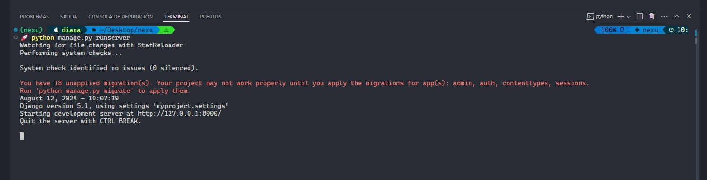


Y para que ya no nos salga ese error, vamos a correr el comando que justamente la terminal nos esta mostrando, el cual es el siguiente:

```bash
python manage.py migrate 
```


Para poder entrar al paner de admin de Django, será con la siguiente ruta:
http://127.0.0.1:8000/admin/

Al momento de querer entrar al panel nos piden Username y Password, por lo que ese hay que crearlo para poder acceder a dicho panel, este comando nos pide una dirección de correo por lo que yo hice el intento en poner un correo que no existe y lo marco como invalido por lo que es importante mencionar que es necesario poner un correo electronico valido, haremos uso del siguiente comando:

```bash
python manage.py createsuperuser 
```

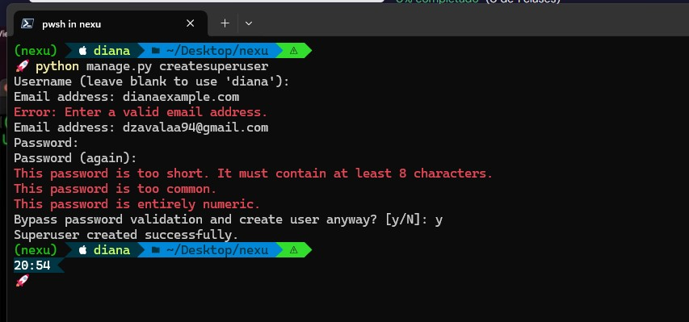

Después de ejecutar el comando anterior, y crear nuestro usuario y contraseña podemos acceder sin problema a la ligar que se puso anteriormente (http://127.0.0.1:8000/admin/)


## ¿Cómo ejecutar el proyecto?

1.- Asegurarse de tener instalado Python, en mi caso yo tengo la versión de Python 3.12.4, la forma de verificar si se tiene instalado es con el siguiente comando:

```bash
python --version
```

En caso de no tenerlo, hay que visitar la página https://www.python.org/downloads/ se puede encontrar la información de cualquier sistema operativo, de igual manera enlisto los más comunes.

En caso de *Windows* para que nos descargue el instalador que se necesita.

En caso de usar Mac se usa el siguiente comando:
```bash
brew install python
```

En caso de Ubuntu se usa el siguiente comando:
```bash
sudo apt update
sudo apt install python3
```

2.- Creación del entorno virtual, yo lo hice en Window por lo que será necesario acceder a la ruta donde esta el proyecto y luego crear el entorno virtual.

```bash
cd /ruta/proyecto
python -m venv nombre_del_entorno
```

3.- Activar el entorno virtual
```bash
cd /ruta/proyecto
nombre_del_entorno\Scripts\activate
```

4.- Instalar dependencias, en este paso se requiere un archivo llamado *requirements.txt*, el cual ya viene en la carpeta del proyecto.
```bash
pip install -r requirements.txt
```

5.- Para la base de datos al ser la primera vez en usarla es necesario hacer las migraciones.

```bash
python manage.py migrate
```

6.- Cargar datos del JSON
```bash
python manage.py loaddata nombre_del_fixture.json
```

7.- Ejecutar el servidor
```bash
python manage.py runserver
```


## Rutas

Las rutas que se manejaron son las siguientes:

     GET    /brands
     GET    /brands/:id/models
     POST   /brands
     POST   /brands/:id/models
     PUT    /models/:id
     GET    /models

Para probar los endpoints desde url en Insomnia, pongo el ejemplo de como se uso:

GET /models - http://127.0.0.1:8000/models/
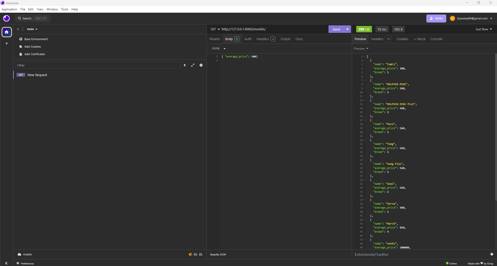

GET /brands - http://127.0.0.1:8000/brands/
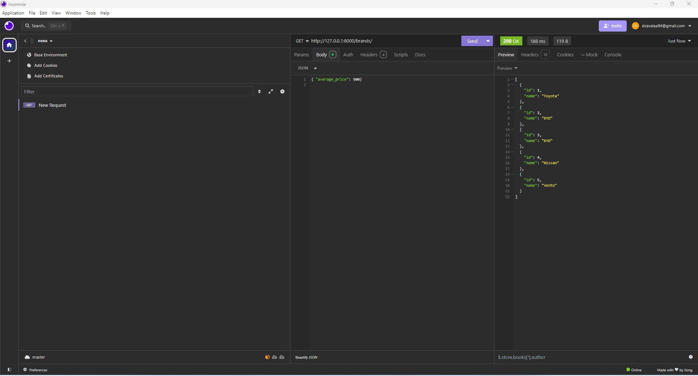

GET /brands/:id/models - http://127.0.0.1:8000/brands/2/models/
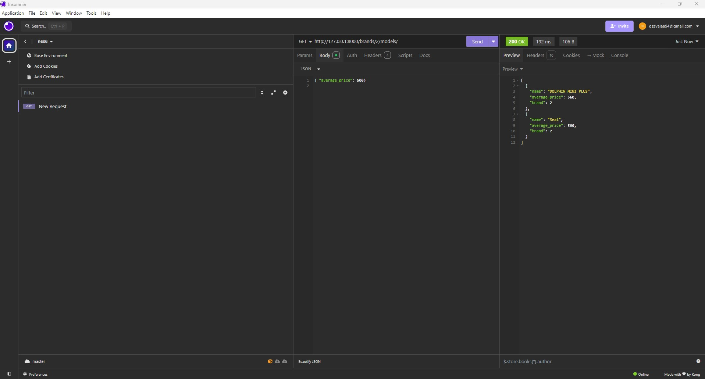
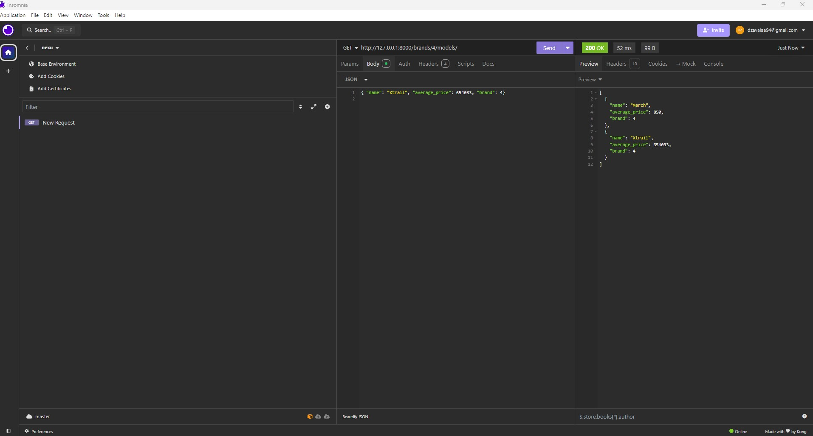

POST /brands/:id/models - http://127.0.0.1:8000/brands/4/models/
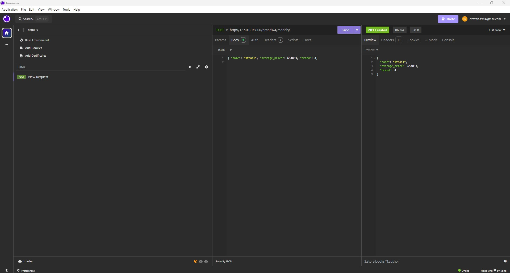

POST /brands - http://127.0.0.1:8000/brands/
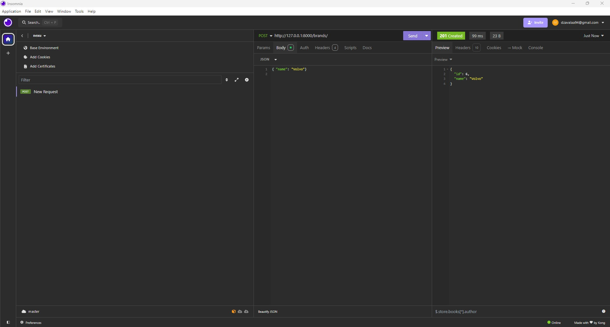

PUT /models/:id - http://127.0.0.1:8000/models/2/
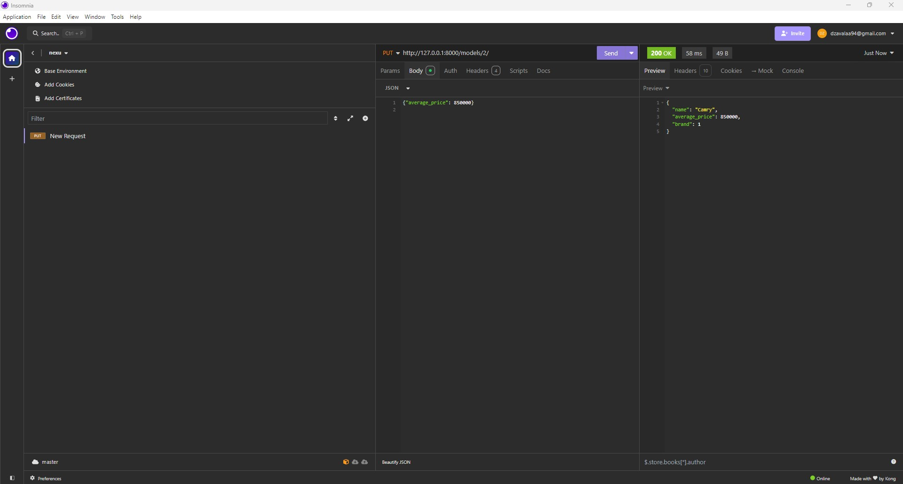
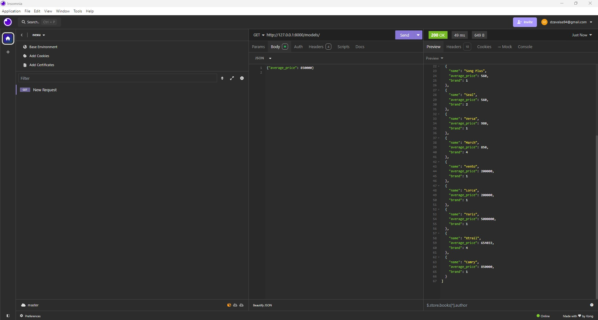
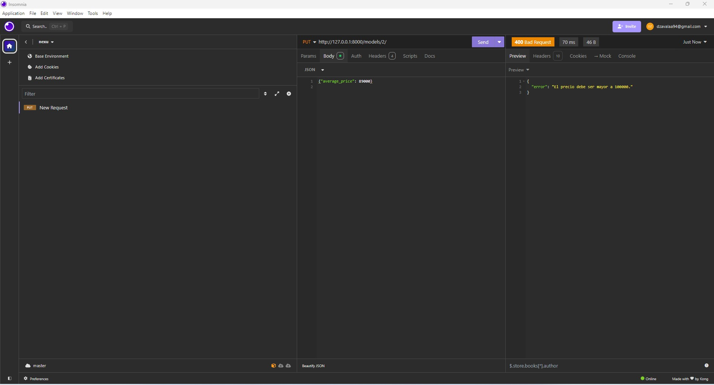


# Desarrollo
A continuación se describe como se comenzó con el desarrollo del proyecto y la explicación a lo que se uso, en este caso para poder poner manos a la obra hay que hacer uso de:

- Modelos
- Archivo JSON
- Migraciones
- Loaddata
- App
- Django REST Framework
- PostgreSQL (Dbeaver)
- Serializer

### Modelos

Antes de comenzar con la parte de JSON es importante ver cuantos modelos vamos a crear, en este caso vamos a tener 2 modelos, que son los siguientes:

- brands
- models

### JSON 

Para comenzar a poblar la base de datos en Django vamos a crear y utilizar un archivo JSON con los datos estructurados que nos mencionan en la prueba de acuerdo a los modelos que vamos a utilizar en la aplicación web, posteriormente vamos a utilizar Django para cargar esos datos en la base de datos.

Se crearon 2 archivos JSON, uno para brands y otro para models, en **brands** concentramos el campo **nombre** como tal de la marca con su respectivo **ID** y en el archivo **models** de igual manera la estructura es su **ID** y como campos se maneja **nombre** del modelo, **precio** y **marca** que le corresponde.


### Migraciones
¿Qué son las migraciones?
Las migraciones son una manera incremental que nos ayuda a actualizar el esquema, o bien el como este formada la base de datos.
En este caso Django ya viene con una serie de migraciones listas para poder aplicar, adicional de que también se pueden crear las propias migraciones que nosotros necesitemos esto para poder tener la libertad de ir construyendo el proyecto a la medida y con lo que se necesite, justamente sin limitarnos a lo que ya se tiene.

Las migraciones son obligatorias, el sistema luego no va a funcionar bien, porque si le decimos que guarde la información no va a encontrar justamente donde guardarla.

Vamos esta es la forma en la que Django se comunica con la base de datos.

### ¿Qué son las Django Apps?

Son pequeñas librerías diseñadas para representar un aspecto único del proyecto. Un proyecto en Django esta construido por multiples Django Apps, algunas de ellas son construidas dentro del proyecto y otras pueden venir de terceros - Modularizado para que sea más organizado.
En pocas palabras las apps son módulos que van a estar dentro de nuestro proyecto.
## Creación del proyecto
### Crear una APP
Al crear esta se mantiene en el mismo nivel que la primera carpeta que se creo, sólo que al entrar a esta carpeta que creo la APP podemos ver archivos como view.py, test.py , models.py, etc
Para poder crearlo entonces corremos el siguiente comando:

```bash
python manage.py startapp nexuapp
```

### Creamos nuestros modelos
Al crear una app esta justamente nos brinda un archivo donde vamos a crear y concentrar nuestros modelos, previamente se hicieron los archivos JSON donde justamente se estructuro tanto en brands como en models, una vez creados los modelos vamos al archivo **admin.py** que se encuentra en la carpeta de nuestra app para agregar nuestro modelo a nuestro panel de administración, ¿Y esto para qué? para que en el admin lo podamos visualizar, y después de hacerlo hay que migrar, llevar acabo esto nos ayudará a que todo sea mejor gestionado.

IMPORTANTE: Antes de hacer la migración la misma app debe detectar los cambios realizados, para ello tenemos que ir al archivo **myproject/settings.py** para poder registrar nuestra aplicación en la configuración principal del proyecto.


```bash
INSTALLED_APPS = [
    'django.contrib.admin',
    'django.contrib.auth',
    'django.contrib.contenttypes',
    'django.contrib.sessions',
    'django.contrib.messages',
    'django.contrib.staticfiles',
    'nexuapp',
]
```
Ahora si una vez registrada la app, esta misma debe detectar los cambios, ¿Qué pasa si no se registra? al momento de hacer **makemigrations** nos va a arrojar un mensaje de *No change detected*

El comando para crear la migración es el siguiente:

```bash
python manage.py makemigrations
```

Con el anterior comando se **CREAN** las migraciones pero necesitamos aplicarlas para ello vamos a hacer uso de otro comando:

```bash
python manage.py migrate
```
**NOTA:** Como recomendación siempre que hagan sus modificaciones en los modelos, corra el comando de makemigrations porque uno nunca sabe que cambios se apliquen o no, así prevenimos ver que cambios arroja.

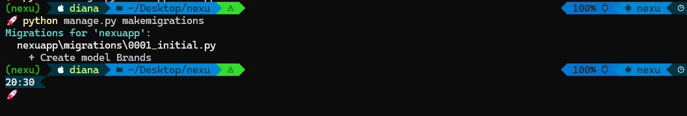


##Django REST Framework

### ¿Qué es una API?
Una API son mecanismos que permiten que dos componentes de software puedan comunicarse entre si mediantes ciertos protocolos.
Un usuario entra a un sistema web por medio de un navegador, la API recibe la petición que realizó el usuario y lo manda al servidor y el servidor se comunica con la base de datos donde esta almacenada la información.

Hay diferentes API's algunas de ellas son: SOAP, WebSocket, REST, etc en este caso usaremos REST, ya que una de las ventajas que le veo es que es flexible y popular ya que muchas aplicaciones web las trabajan. 
¿Cómo funciona? en este caso el cliente envia las solicitudes al servidor como datos, después el servidor utiliza esta entrada del cliente para poder iniciar funciones internas y devolver los datos de salida al cliente.

### ¿Qué es una REST?
Es un estilo de arquitectura de softwarepara poder realizar una comunicación cliente-servidor.
Los clientes y los servidores intercambian datos mediantes HTTP.

### ¿Qué es una RESTful?
En este caso es la implementación de dicha arquitectura aquí justamente define un conjunto de funciones como GET, PUT, DELETE, etc los cuales son utilizados por el cliente para acceder a los datos del servidor.
La principal caracteristica que tiene la API de REST es que no tiene estado.

### Seguridad API's
Hoy en día se necesita proteger la información que se maneja por lo que las API necesitan protegerse y para ellos existen 2 maneras:
- Tokens de autenticación
- Claves de API

### Instalación Django REST Framework
Para poder instalar Django REST Framework se va a hacer uso del siguiente comando:
```bash
pip install djangorestframework
```
Una vez que se ejecuto el comando anterior será muy importante agregar **'rest_framework'** a **settings.py**

```bash
INSTALLED_APPS = [
    'django.contrib.admin',
    'django.contrib.auth',
    'django.contrib.contenttypes',
    'django.contrib.sessions',
    'django.contrib.messages',
    'django.contrib.staticfiles',
    'nexuapp',
    'rest_framework',
]
```

### Conexión a la base de datos PostgreSQL y conexión con Django REST Framework
En este punto yo utilice la herramienta de DBeaver ya que se me facilita más gestionar las bases de datos con ella, pero antes de meternos a la herramienta en **myproject/settings.py** vamos a modificar la parte de DATABASES para poder crear una conexión con PostgreSQL y después de realizarlo hacer otra conxión pero esta vez con Django Rest Framework.

```bash
DATABASES = {
    'default': {
        'ENGINE': 'django.db.backends.postgresql',
        'NAME': 'bd_nexu',
        'USER': 'postgres',
        'PASSWORD': '123456',
        'HOST': 'localhost',
        'PORT': '5432',
    }
}
```


En dbeaver procedemos a crear una base de datos con PostgreSQL y en nuestra terminal corremos el comando:
```bash
python manage.py migrate
```

Y nos saldrá un error como el siguiente:

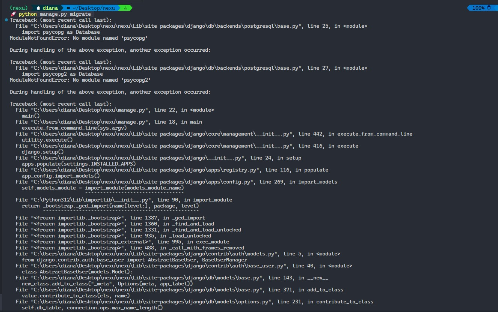

Para evitar ese error vamos a installar **psycopg** con el siguiente comando:
```bash
pip install psycopg
```

Nuevamente corremos el comando migrate para que jale todas toda la información que previamente se estructuro en los modelos con el siguiente comando:

```bash
python manage.py migrate
```

Ahora podemos ver en el lado de Dbeaver como se actualiza la información se debe mostrar así

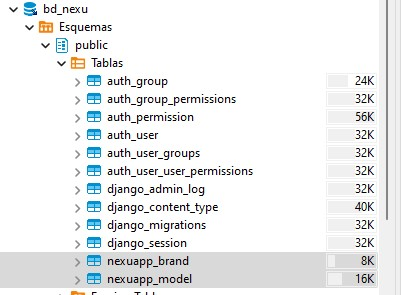


### Serializer o Serialización
Hay que crear un serializador, ya que lo que nos permite es convertir objetos de Django, por ejemplo, en los modelos que tenemos lo convierte en un objeto de tipo JSON, lo que nos hace es facilitar la serialización y la deserialización de datos con nuestras API's 

Dentro de la carpeta de nuestro proyecto **nexuapp** vamos a crear un archivo que tiene por nombre **serializer.py**, aquí haremos las importaciones respectivas justamente con el REST Framework y necesitamos los modelos que vamos a trabajar mano a mano con el serializador.

### Views
Justamente las vistas nos ayudan a encapsular y guarda la lógica la cual es la comunicación entre el usuario y nuestro sistema, estás van la mano con Django REST Framework, Serialización, Modelos y Urls ya que al formarse paso a paso la creación de las API's todo forma un conjunto para obtenerlas.

En el archivo **views.py** encontramos toda la lógica para la creación de nuestros métodos de cada endpoint, en total son 6.

En esta se tienen 4 clases cada una de ellas ayuda a la creación de los endpoint.

- class BrandViewSet: Esta clase es utilizada para la parte del método GET /brands y también para POST /brans lo trabaje en una misma clase para que no hubiera conflictos al momento de checar el endpoint en Insomnia cada url, ya que al final en una de las 2 no se iba a poder acceder, en esta clase se uso *ViewSets* para poder realizar interacciones con la API y adicional ayuda a gestionar la construcción de las url de manera automática, así mismo también se uso *ModelViewSet* es una vista que nos ayudo basicamente a crear un CRUD que sirve para realizar ciertas acciones como Eliminar, Actualizar, Editar, etc.

Dentro de esta clase se definieron 2 funciones, la primera *list* que nos ayudará a listar lo que es todas nuestras marcas que tenemos al hacer un GET y la segunda *create* que nos ayudará a ejecutar el método POST ya que con esa funcióin se puede ingresar una nueva marca y se valida si ya existe en nuestro listado.


- class ModelViewSet: Esta clase es utilizada para el método GET pero ahora de /models donde hacemos uso nuevamente de *ViewSets* y *ModelViewSet*, aquí también usamos queryset ya que nos permite leer los datos en este caso de todo lo que tiene el objeto para poderlo mostrar.


- BrandModelView: En esta clase le pasamos *APIView* podemos reescribir la vista raíz como una vista basada en clases. Ya que nos da o proporciona métodos de acción para interactuar con la API como GET, POST, PUT, PATCH y DELETE en lugar de definir los métodos del controlador. Aquí también se trabajo una sola clase para 2 métodos el mismo pensamiento fue evitar conflictos por se la misma url, aquí se trabajaron 2 funciones, una para el método GET primero valida si existen marcas en caso de que si va a mostrar el listado completo de acuerdo al id y en caso de que no entonces mostrara un mensaje de error que justo le avisa que no existe dicha marca, la otra función es post ya que con esta podemos insertar un nuevo modelo con su respectiva marca, aquí también se valido que fuera un solo modelos por marca para evitar que una sola marca tuviera repetido un modelo, de lo contrario manda un mensaje de error, en esta parte se agrego request.data.copy() buscando crear una copia de los datos porque al momento de checar el endpoint en Insomnia se estaban sobreescribiendo los datos ya que antes sólo tenía *request.data* y noté que al hacer cualquier modificación directa generaba conflictos.


- UpdateModelView: Por último tenemos la clase que tiene la lógica para el método PUT, donde primero se usa un queryset para leer los datos en este caso de todo lo que tiene el objeto para poderlo mostrar, como en esta clase se busco centrar el PUT en base al id se uso *lookup_field = 'id'* para poder identificar el objeto también se definio una función put donse agrego un objeto de la clase model donde comparar un id con otro id y en caso de no coincidir se lanzará una excepción, así mismo obtenemos datos de average_price que nos ayudara con las validaciones necesarias para verificar si el valor es igual o menor a 100000 si lo es continúa con la modificación de manera exitosa sino nos mandara un error que justamente dirá que el precio debe ser mayor a lo antes especificado.


En todas las clases se hizo uso de serialización para poder encapsular mejor todos los objetos de los modelos en un formato que sea entendible para un archivo JSON o una base de datos.


## Mejoras en el proyecto

Me hubiera gustado meterle más cosas de **seguridad** justo para la parte de la base de datos y proteger la información ya que esto a la larga es muy importante.

Manejar una tecnología frontend con React o Angular para poder crear algo más completo, se que el proyecto es meramente BackEnd y será probado en un FrontEnd pero me hubiera gustado también agregarle algo de Front.

Y por último me hubiera gustado meterle Docker, como mencione al inicio en este proyecto se creo un entorno virtual que gestiona mejor muchas cosas del proyecto y evita conflictos, me hubiera gustado crear un contenedor con Docker para que empaquete o encapsule todo el proyecto se corra/ejecute de manera identica en cualquier entorno que se tenga esto garantiza una mejor gestión de estos mismos entornos y hablo de manera local, en desarrollo o en producción.


## Articulos de apoyo

 - [Django Queries](https://docs.djangoproject.com/en/5.0/topics/db/queries/)
 - [Django Rest Framework](https://realpython.com/django-rest-framework-quick-start/)
 - [Django Documentation](https://www.djangoproject.com/)

